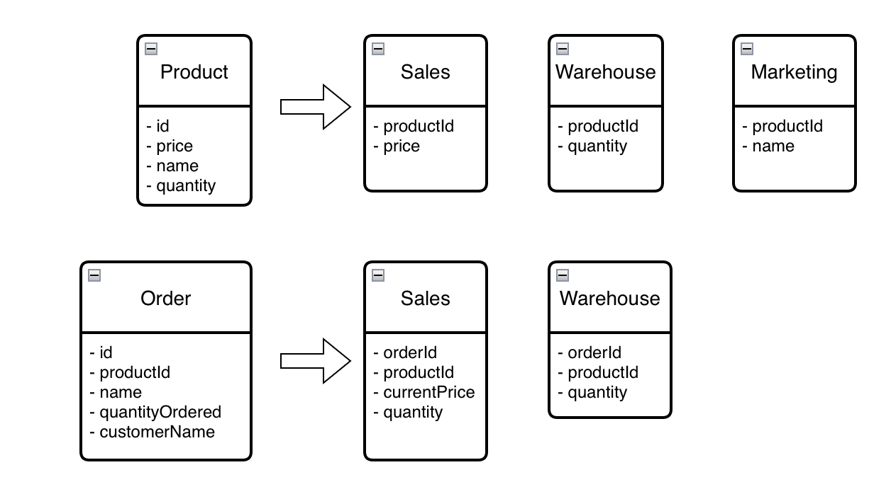

## Getting Started

Run `docker compose --profile product-init --profile order-init up -d --build`

Then u can just run `docker compose up -d`

## Tests

Product service: `cd product-service && ./bin/tests`

Order service: `cd order-service && ./bin/tests`

## Conclusions
1. The development task lacked specific requirements, providing only predefined design and architecture. Consequently, my ability to showcase design skills was limited, as the proposed solution constrained me to the tactical level rather than allowing strategic decisions.
2. The design of the Order and Product services follows an entity-centric approach, which tends to result in high coupling and low cohesion. During service discovery, the focus should be on functionality and team responsibilities, rather than revolving around entities.
3. Entity-centric services often lead to the use of CRUD operations, which may not be the optimal choice. A task-based approach is generally preferred for better design and implementation.
4. The solution leans towards procedural programming, rendering the use of true object-oriented programming (OOP) unnecessary.
5. The necessity of having a copy of the product in the order service is unclear. Utilizing application-level joins, such as querying /products?ids=1,2,3,4,5, could be a more efficient alternative.
6. While using bundles to share code may be suitable for frameworks or low-level support, it is not the best choice for business logic. Symfony's decision to stop recommending bundle usage within applications starting from version 4 is commendable.
7. Sharing entities, even as data structures, between services is considered bad practice. It is preferable to duplicate them to ensure freedom to make changes without introducing risks. However, complete entity duplication should be avoided, and partial duplication might be a more practical approach.
8. Sharing RabbitMQ configuration may be unnecessary in these cases. Using environment variables proved sufficient for me, although I am not aware of established best practices for this particular scenario.
9. The Quantity field was removed from the Product entity in the Order service since including it in GET /orders requests seemed unnecessary.
10. Object values were not extensively used in the code due to incompatibility with Doctrine, each value object requires doctrine type. Typically, all primitives should be encapsulated within objects with embedded validation, such as ProductId, ProductName, and ProductQuantity, although in this case, Symfony's validation approach was employed.

## SOA
Product and Order are entities, one entity can be presented in different services, aggregates, tables. The only thing that connects this entity data to each other is the entity identifier.

